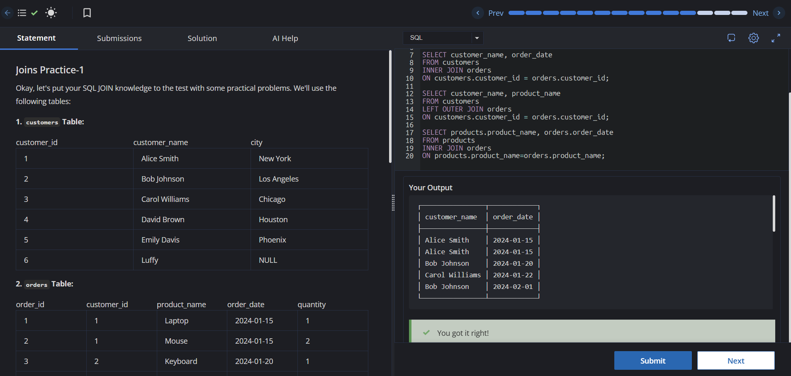

# Experiment 4 - Task 1

**Name:** Kunal Arora  
**UID:** 24BCS10385  

## Aim

To practice SQL JOIN operations across the `customers`, `orders`, and `products` tables.

## Question

Write SQL queries to:

1. List customer names with their order dates.
2. List all customers with their ordered products (including customers with no orders).
3. Display product names with the order dates for ordered products.

## SQL Queries Used

### 1. Customers and Their Order Dates (INNER JOIN)

```sql
SELECT c.customer_name, o.order_date
FROM customers c
INNER JOIN orders o
ON c.customer_id = o.customer_id;
```

### 2. All Customers and Their Ordered Products (LEFT JOIN)

```sql
SELECT c.customer_name, o.product_name
FROM customers c
LEFT JOIN orders o
ON c.customer_id = o.customer_id;
```

### 3. Ordered Products with Order Dates (INNER JOIN)

```sql
SELECT p.product_name, o.order_date
FROM products p
INNER JOIN orders o
ON p.product_name = o.product_name;
```

## Output

The queries return:

1. Customer names along with their corresponding order dates.
2. All customers and the products they ordered, displaying `NULL` for customers who have not placed any orders.
3. Product names along with the dates on which they were ordered.

## Output Screenshot



## Image Explanation

The screenshot shows the successful execution of the SQL JOIN queries and the resulting data, including customer names, product names, and order dates based on the specified JOIN operations.

## Result

The SQL JOIN queries were executed successfully and produced the required customer, product, and order mapping results.