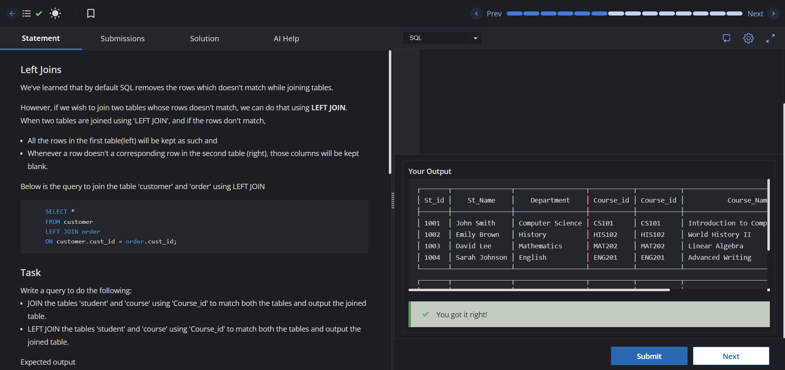

# Experiment 4 - Task 2

**Name:** Kunal Arora  
**UID:** 24BCS10385  

## Aim

To practice SQL `INNER JOIN` and `LEFT JOIN` operations using the `student` and `course` tables.

## Question

Write SQL queries to:

1. Perform an `INNER JOIN` between the `student` and `course` tables using `Course_id`.
2. Perform a `LEFT JOIN` between the `student` and `course` tables using `Course_id`.

## SQL Queries Used

### 1. INNER JOIN

```sql
SELECT *
FROM student
JOIN course
ON student.Course_id = course.Course_id;
```

### 2. LEFT JOIN

```sql
SELECT *
FROM student
LEFT JOIN course
ON student.Course_id = course.Course_id;
```

## Output

The queries return:

1. All students with matching course details using `INNER JOIN`.
2. All students along with their course details using `LEFT JOIN`, displaying `NULL` for students whose course information is unavailable.

## Output Screenshot



## Image Explanation

The screenshot shows the successful execution of the `INNER JOIN` and `LEFT JOIN` queries. The first result includes only matching student-course records, while the second result includes all students along with matching course information where available.

## Result

The `INNER JOIN` and `LEFT JOIN` queries were executed successfully and produced the required student and course information.