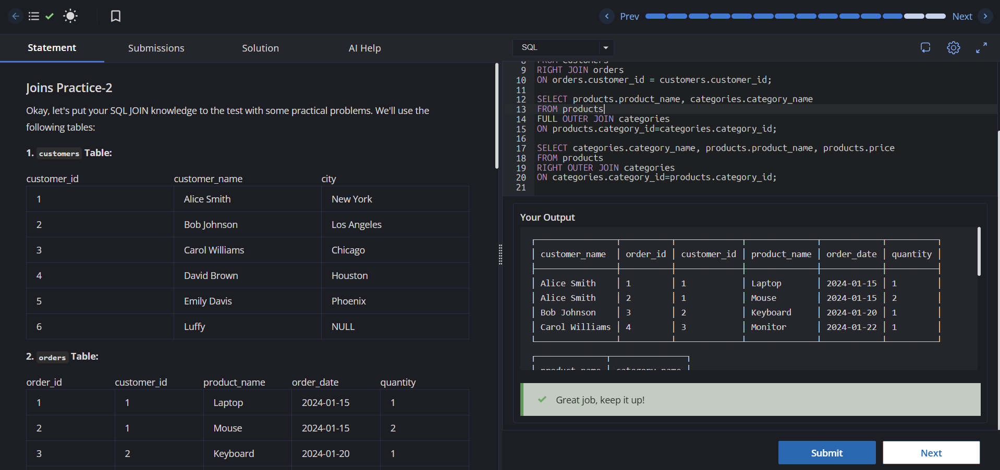

# Experiment 4 - Task 3

**Name:** Kunal Arora  
**UID:** 24BCS10385  

## Aim

To practice SQL `RIGHT JOIN` and `FULL OUTER JOIN` operations using the `customers`, `orders`, `products`, and `categories` tables.

## Question

Write SQL queries to:

1. Get all orders along with the details of their respective customers (if they exist).
2. Create a combined list of all products and all categories, showing matches where available.
3. Display all category names along with their product names and prices.

## SQL Queries Used

### 1. All Orders with Customer Details (RIGHT JOIN)

```sql
SELECT customers.customer_name, orders.*
FROM customers
RIGHT JOIN orders
ON orders.customer_id = customers.customer_id;
```

### 2. Products and Categories (FULL OUTER JOIN)

```sql
SELECT products.product_name, categories.category_name
FROM products
FULL OUTER JOIN categories
ON products.category_id = categories.category_id;
```

### 3. All Category Names with Product Details (RIGHT OUTER JOIN)

```sql
SELECT categories.category_name, products.product_name, products.price
FROM products
RIGHT OUTER JOIN categories
ON categories.category_id = products.category_id;
```

## Output

The queries return:

1. All orders along with the corresponding customer details where available.
2. A combined list of all products and categories, displaying `NULL` where no matching record exists.
3. All category names together with their associated product names and prices, displaying `NULL` for categories without products.

## Output Screenshot



## Image Explanation

The screenshot shows the successful execution of the SQL queries, demonstrating the use of `RIGHT JOIN` and `FULL OUTER JOIN` to retrieve matching as well as unmatched records from the related tables.

## Result

The SQL JOIN queries were executed successfully and produced the required customer, product, category, and order details using `RIGHT JOIN` and `FULL OUTER JOIN`.