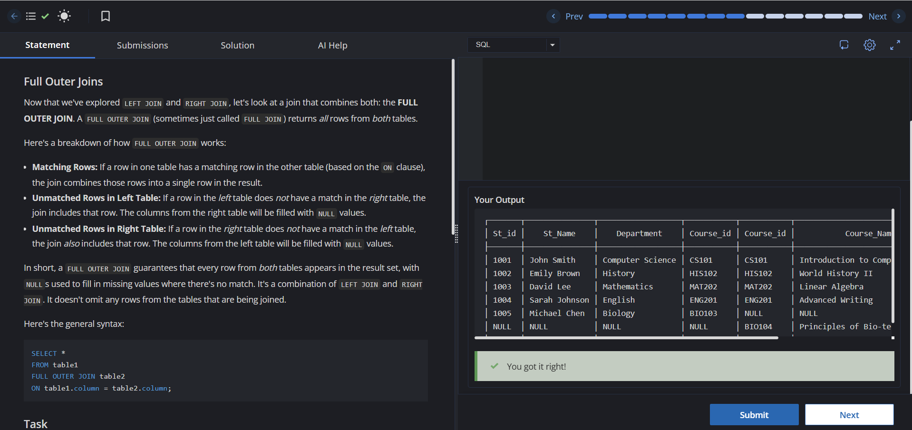

# Experiment 4 - Task 4

**Name:** Kunal Arora  
**UID:** 24BCS10385  

## Aim

To practice the SQL `FULL OUTER JOIN` operation by combining data from the `student` and `course` tables.

## Question

Write a SQL query to perform a `FULL OUTER JOIN` between the `student` and `course` tables using `Course_id` as the matching column and display the joined table.

## SQL Query Used

```sql
SELECT *
FROM student
FULL OUTER JOIN course
ON student.Course_id = course.Course_id;
```

## Output

The query returns all records from both the `student` and `course` tables. Matching rows are combined based on `Course_id`, while unmatched rows from either table are included with `NULL` values for the missing columns.

## Output Screenshot



## Image Explanation

The screenshot shows the successful execution of the `FULL OUTER JOIN` query, displaying all students and courses, including records that do not have corresponding matches in the other table.

## Result

The `FULL OUTER JOIN` query was executed successfully and displayed all matching and non-matching records from the `student` and `course` tables.