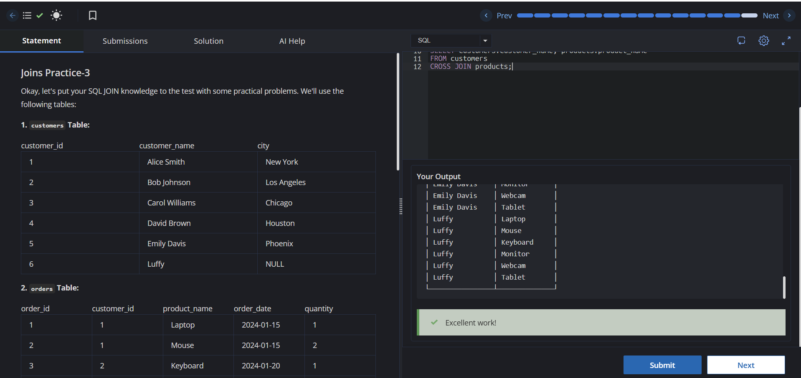

# Experiment 4 - Task 5

**Name:** Kunal Arora  
**UID:** 24BCS10385  

## Aim

To practice SQL `SELF JOIN` and `CROSS JOIN` operations using the `employees`, `customers`, and `products` tables.

## Question

Write SQL queries to:

1. Display a list of employee names along with their manager's names.
2. Show every possible combination of customer names and product names.

## SQL Queries Used

### 1. Employee and Manager Names (SELF JOIN)

```sql
SELECT e1.employee_name AS Employee, e2.employee_name AS Manager
FROM employees AS e1
LEFT JOIN employees AS e2
ON e1.manager_id = e2.employee_id;
```

### 2. Every Possible Combination (CROSS JOIN)

```sql
SELECT customers.customer_name, products.product_name
FROM customers
CROSS JOIN products;
```

## Output

The queries return:

1. A list of employees along with their respective managers, displaying `NULL` for employees without a manager.
2. Every possible combination of customer names and product names using a Cartesian product.

## Output Screenshot



## Image Explanation

The screenshot shows the successful execution of the `SELF JOIN` and `CROSS JOIN` queries. The first result maps employees to their managers, while the second result displays all possible customer-product combinations.

## Result

The SQL `SELF JOIN` and `CROSS JOIN` queries were executed successfully and produced the required employee-manager relationships and customer-product combinations.