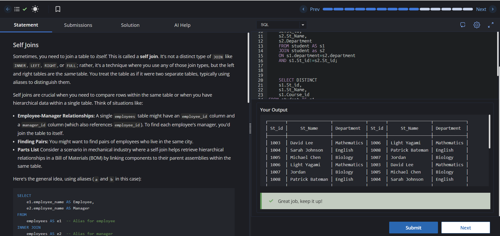

# Experiment 4 - Task 6

**Name:** Kunal Arora  
**UID:** 24BCS10385  

## Aim

To practice SQL `SELF JOIN` operations on the `student` table for identifying students with common departments and favorite courses.

## Question

Write SQL queries to:

1. Find pairs of students who belong to the same department.
2. Identify students who have selected the same `Course_id` as their favorite. Display the `St_id`, `St_Name`, and `Course_id` in increasing order of `Course_id`.

## SQL Queries Used

### 1. Find Student Pairs from the Same Department (SELF JOIN)

```sql
SELECT
    s1.St_id,
    s1.St_Name,
    s1.Department,
    s2.St_id,
    s2.St_Name,
    s2.Department
FROM student AS s1
JOIN student AS s2
ON s1.Department = s2.Department
AND s1.St_id != s2.St_id;
```

### 2. Find Students with the Same Favorite Course (SELF JOIN)

```sql
SELECT DISTINCT
    s1.St_id,
    s1.St_Name,
    s1.Course_id
FROM student AS s1
INNER JOIN student AS s2
ON s1.Course_id = s2.Course_id
AND s1.St_id != s2.St_id
ORDER BY s1.Course_id;
```

## Output

The queries return:

1. Pairs of students who belong to the same department.
2. Students who have selected the same favorite course, displaying their student ID, name, and course ID in ascending order of `Course_id`.

## Output Screenshot



## Image Explanation

The screenshot shows the successful execution of the `SELF JOIN` queries. The first result identifies students from the same department, while the second result lists students sharing the same favorite course.

## Result

The `SELF JOIN` queries were executed successfully and correctly identified students belonging to the same department and students with the same favorite course.