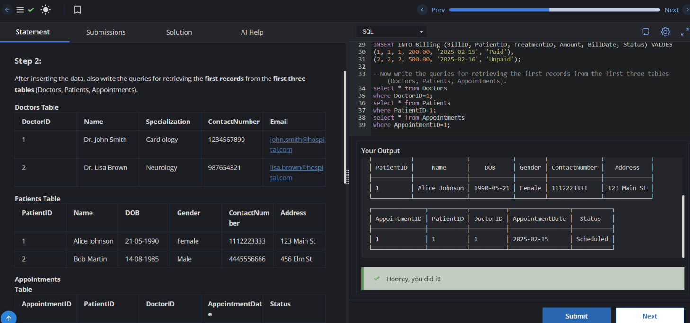

# Experiment 1 - Task 1

**Name:** Kunal Arora  
**UID:** 24BCS10385  

## Aim

To practice inserting data into multiple tables and retrieving specific records from the `Doctors`, `Patients`, and `Appointments` tables.

## Question

Complete the SQL queries to:

1. Insert data into the `Doctors` table.
2. Insert data into the `Patients` table.
3. Insert data into the `Appointments` table.
4. Insert data into the `Treatments` table.
5. Insert data into the `MedicalRecords` table.
6. Insert data into the `Billing` table.
7. Retrieve the first record from each of the first three tables: `Doctors`, `Patients`, and `Appointments`.

## SQL Queries Used

### 1. Inserting Data into Doctors Table

```sql
INSERT INTO Doctors (DoctorID, Name, Specialization, ContactNumber, Email) VALUES
(1, 'Dr. John Smith', 'Cardiology', '1234567890', 'john.smith@hospital.com'),
(2, 'Dr. Lisa Brown', 'Neurology', '0987654321', 'lisa.brown@hospital.com');
```

### 2. Inserting Data into Patients Table

```sql
INSERT INTO Patients (PatientID, Name, DOB, Gender, ContactNumber, Address) VALUES
(1, 'Alice Johnson', '1990-05-21', 'Female', '1112223333', '123 Main St'),
(2, 'Bob Martin', '1985-08-14', 'Male', '4445556666', '456 Elm St');
```

### 3. Inserting Data into Appointments Table

```sql
INSERT INTO Appointments (AppointmentID, PatientID, DoctorID, AppointmentDate, Status) VALUES
(1, 1, 1, '2025-02-15', 'Scheduled'),
(2, 2, 2, '2025-02-16', 'Completed');
```

### 4. Inserting Data into Treatments Table

```sql
INSERT INTO Treatments (TreatmentID, PatientID, DoctorID, Diagnosis, TreatmentDescription, TreatmentDate) VALUES
(1, 1, 1, 'Hypertension', 'Prescribed medication', '2025-02-15'),
(2, 2, 2, 'Migraine', 'MRI Scan and medications', '2025-02-16');
```

### 5. Inserting Data into MedicalRecords Table

```sql
INSERT INTO MedicalRecords (RecordID, PatientID, TreatmentID, Notes) VALUES
(1, 1, 1, 'Patient responding well to treatment'),
(2, 2, 2, 'Further evaluation required');
```

### 6. Inserting Data into Billing Table

```sql
INSERT INTO Billing (BillID, PatientID, TreatmentID, Amount, BillDate, Status) VALUES
(1, 1, 1, 200.00, '2025-02-15', 'Paid'),
(2, 2, 2, 500.00, '2025-02-16', 'Unpaid');
```

### 7. Retrieving the First Record from Doctors Table

```sql
SELECT *
FROM Doctors
WHERE DoctorID = 1;
```

### 8. Retrieving the First Record from Patients Table

```sql
SELECT *
FROM Patients
WHERE PatientID = 1;
```

### 9. Retrieving the First Record from Appointments Table

```sql
SELECT *
FROM Appointments
WHERE AppointmentID = 1;
```

## Output

The queries successfully inserted the given records into the six tables. The retrieval queries returned the first record from the `Doctors`, `Patients`, and `Appointments` tables based on their respective IDs.

## Output Screenshot



## Image Explanation

The screenshot shows the successful execution of the `INSERT` and `SELECT` queries. The first records from the `Doctors`, `Patients`, and `Appointments` tables are displayed as requested.

## Result

The data was successfully inserted into the required tables, and the first records from the `Doctors`, `Patients`, and `Appointments` tables were retrieved successfully.