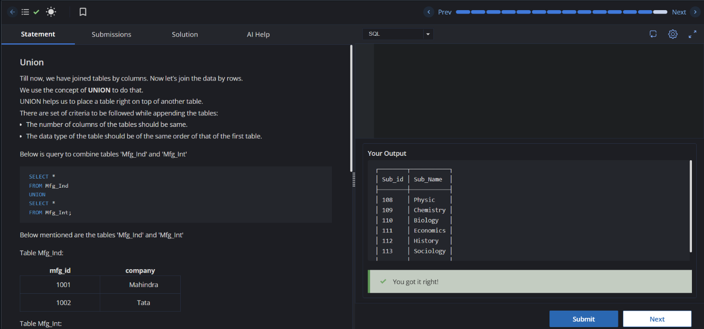

# Experiment 2

**Name:** Kunal Arora  
**UID:** 24BCS10385  

## Aim

To practice SQL set operations including `UNION`, `UNION ALL`, `INTERSECT`, and `EXCEPT`.

## Questions

Write SQL queries to perform the following set operations:

1. Combine records from the `Arts` and `Science` tables using `UNION`.
2. Combine employee names from the `Employee` and `pt_employee` tables using `UNION ALL`.
3. Find common fruit and inventory names using `INTERSECT`.
4. Find fruit names that are not present in the inventory using `EXCEPT`.

## SQL Queries Used

### Experiment 2.1 - UNION

```sql
SELECT *
FROM Arts
UNION
SELECT *
FROM Science;
```

#### Output Screenshot



#### Image Explanation

The screenshot shows the successful execution of the `UNION` query, combining records from the `Arts` and `Science` tables while removing duplicate records.

---

### Experiment 2.2 - UNION ALL

```sql
SELECT emp_name
FROM Employee
UNION ALL
SELECT emp_name
FROM pt_employee;
```

---

### Experiment 2.3 - INTERSECT

```sql
SELECT f_name
FROM fruit
INTERSECT
SELECT inv_name
FROM inventory;
```

#### Output Screenshot

.png)

#### Image Explanation

The screenshot shows the successful execution of the `INTERSECT` query, displaying the fruit names that are present in both the `fruit` and `inventory` tables.

---

### Experiment 2.4 - EXCEPT

```sql
SELECT f_name
FROM fruit
EXCEPT
SELECT inv_name
FROM inventory;
```

#### Output Screenshot

.png)

#### Image Explanation

The screenshot shows the successful execution of the `EXCEPT` query, displaying the fruit names that are present in the `fruit` table but not in the `inventory` table.

## Result

The SQL set operation queries were executed successfully. `UNION`, `UNION ALL`, `INTERSECT`, and `EXCEPT` were used to combine and compare records from different tables as required.