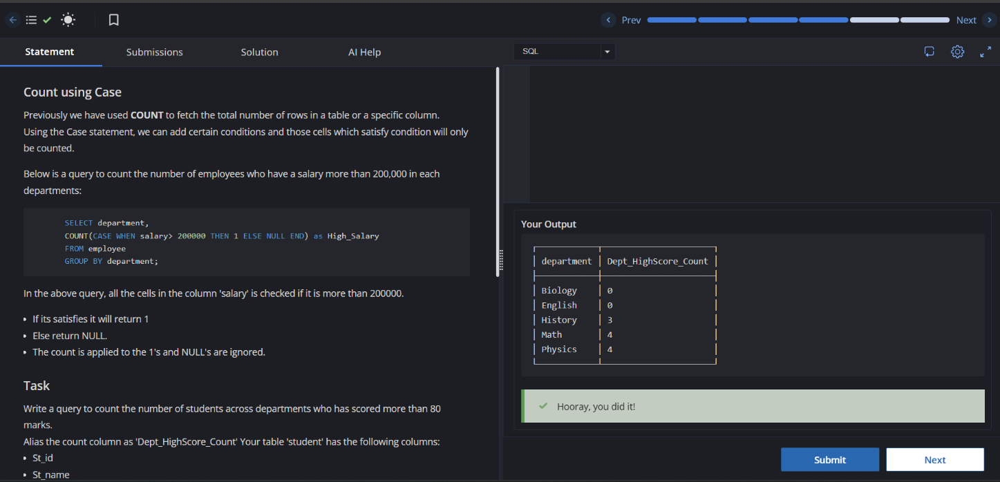

# Experiment 3

**Name:** Kunal Arora  
**UID:** 24BCS10385  

## Aim

To practice SQL aggregate functions, conditional aggregation, grouping, sorting, `HAVING`, `DISTINCT`, and subqueries.

## Questions

The experiment consists of the following tasks:

1. Count students scoring above 80 marks in each department.
2. Perform various aggregate operations on an employee dataset, including counting employees, sorting grouped results, conditional counting, using the `HAVING` clause, calculating average salaries, and retrieving distinct cities.
3. Find customers who have not placed any orders using a subquery.

---

# Experiment 3.1

## Question

Count the number of students in each department who have scored more than 80 marks.

## SQL Query

```sql
SELECT Department,
       COUNT(CASE WHEN Marks > 80 THEN 1 ELSE NULL END) AS Dept_HighScore_Count
FROM student
GROUP BY Department;
```

## Output Screenshot



## Image Explanation

The screenshot shows the number of students scoring above 80 marks for each department. The results are grouped according to the `Department` column.

---

# Experiment 3.2

## Question

Perform aggregate operations on the `employees` table, including:

1. Count the number of employees in each city.
2. Sort cities according to employee count in ascending and descending order.
3. Count employees in each city whose salary is greater than or equal to 90000.
4. Use the `HAVING` clause to filter cities based on salary conditions.
5. Find the average salary of employees in each city.
6. Retrieve distinct employee cities.
7. Count the number of distinct employee cities.

## Creating the Employees Table

```sql
CREATE TABLE employees (
    emp_id INT PRIMARY KEY,
    emp_name VARCHAR(100) NOT NULL,
    emp_salary DECIMAL(10, 2) NOT NULL,
    emp_city VARCHAR(100) NOT NULL
);
```

## Inserting Data

```sql
INSERT INTO employees (emp_id, emp_name, emp_salary, emp_city) VALUES
(101, 'Amit Sharma', 85000.00, 'Mumbai'),
(102, 'Priya Patel', 95000.00, 'Mumbai'),
(103, 'Rahul Verma', 60000.00, 'Delhi'),
(104, 'Ananya Iyer', 110000.00, 'Bangalore'),
(105, 'Vikram Singh', 55000.00, 'Delhi'),
(106, 'Sneha Reddy', 105000.00, 'Bangalore'),
(107, 'Rohan Das', 72000.00, 'Kolkata');
```

## 1. Count Employees in Each City

### Using COUNT(*)

```sql
SELECT emp_city, COUNT(*) AS CNT
FROM employees
GROUP BY emp_city;
```

### Using COUNT(emp_id)

```sql
SELECT emp_city, COUNT(emp_id) AS CNT
FROM employees
GROUP BY emp_city;
```

## 2. Count Employees and Sort by Count

### Ascending Order

```sql
SELECT emp_city, COUNT(emp_id) AS CNT
FROM employees
GROUP BY emp_city
ORDER BY CNT ASC;
```

### Descending Order

```sql
SELECT emp_city, COUNT(emp_id) AS CNT
FROM employees
GROUP BY emp_city
ORDER BY CNT DESC, emp_city ASC;
```

## 3. Count Employees with Salary >= 90000

```sql
SELECT emp_city,
       SUM(CASE WHEN emp_salary >= 90000 THEN 1 ELSE 0 END) AS CNT
FROM employees
GROUP BY emp_city;
```

## 4. Using the HAVING Clause

Find cities that have at least one employee whose salary is greater than or equal to 90000.

```sql
SELECT emp_city
FROM employees
GROUP BY emp_city
HAVING SUM(CASE WHEN emp_salary >= 90000 THEN 1 ELSE 0 END) > 0;
```

## 5. Average Employee Salary of Each City

```sql
SELECT emp_city,
       AVG(emp_salary)::NUMERIC(20,2) AS CNT
FROM employees
GROUP BY emp_city;
```

## 6. Find Distinct Employee Cities

```sql
SELECT DISTINCT emp_city
FROM employees;
```

## 7. Count Distinct Employee Cities

```sql
SELECT COUNT(DISTINCT emp_city) AS CNT
FROM employees;
```

## Output Screenshot

.png)

## Image Explanation

The screenshot shows the successful execution of the aggregate queries on the `employees` table. The results demonstrate employee counts by city, salary-based counting, grouping, sorting, average salary calculations, and the use of `DISTINCT`.

---

# Experiment 3.3

## Question

Find the names of customers who have not placed any orders.

## SQL Query

```sql
SELECT name AS Customers
FROM Customers
WHERE id NOT IN (
    SELECT customerId
    FROM Orders
);
```

## Output Screenshot

.png)

## Image Explanation

The screenshot shows the customers who do not have a corresponding entry in the `Orders` table. A subquery is used to retrieve customer IDs that have placed orders, and `NOT IN` filters them out.

## Result

The SQL queries were executed successfully. Aggregate functions, conditional aggregation, `GROUP BY`, `ORDER BY`, `HAVING`, `DISTINCT`, and subqueries were used to retrieve and analyze the required data.